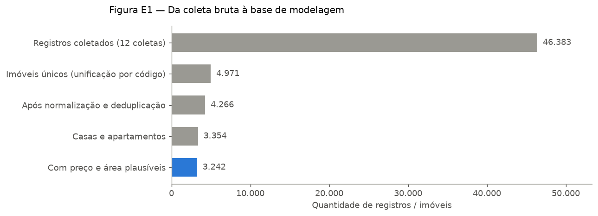

# 1. Coleta e preparação dos dados

## 1.1 Fontes

Os dados são anúncios de imóveis à venda em Chapecó/SC, coletados automaticamente de
8 imobiliárias locais. Cada script de coleta (`scripts/*_v2.py`) grava os anúncios em
um banco SQLite datado (`imoveis_DD_MM_AAAA.db`).

| Imobiliária | Script | Forma de coleta | Prefixo do código |
|---|---|---|---|
| Nostra Casa | `nostracasa_v2.py` | HTML | `N-` |
| Plaza | `plaza_v2.py` | HTML | `PL-` |
| Casa Imóveis | `casaimoveis_v2.py` | HTML | `C-` |
| SIM Imóveis | `sim_v2.py` | API | `SI-` |
| Santa Maria | `santamaria_v2.py` | API | `SM-` |
| Padrá | `padra_v2.py` | API | `P-` |
| Markize | `markize_v2.py` | API | `M-` |
| Katedral | `katedral_v2.py` | HTML | `K-` |

Campos coletados: preço, bairro, cidade, tipo de imóvel, área total, área privativa,
quartos, banheiros, vagas, endereço (quando a fonte expõe) e datas. O link da foto principal
foi incluído nos robôs depois das 12 coletas, por isso nenhum banco do TCC tem fotos.

Os tokens das APIs não ficam no código: são lidos do arquivo `.env` (ver `.env.example`).

## 1.2 Coletas realizadas

Foram feitas **12 coletas** entre março e agosto de 2026:

| Mês | Datas |
|---|---|
| Março | 23/03 |
| Abril | 05/04, 11/04, 26/04 |
| Maio | 03/05, 12/05, 26/05, 31/05 |
| Junho | 15/06, 24/06, 28/06 |
| Julho | (sem coleta) |
| Agosto | 02/08 |

Como o mesmo imóvel aparece em várias coletas, a série histórica permite observar
**como o preço anunciado de cada imóvel muda ao longo do tempo** (base do modelo de
valorização, capítulo 5).

## 1.3 Unificação (`imoveis_ml.py unify`)

Junta todos os bancos `imoveis_??_??_????.db` em `imoveis_unificado.db`:

- **Tabela `imoveis`**: um registro por imóvel, identificado pelo código do anúncio
  (prefixo da imobiliária + número). Campos faltantes em uma coleta são completados
  pelas outras.
- **Tabela `historico_precos`**: todas as observações (código, data da coleta, preço),
  usada para medir a variação de preço dos mesmos imóveis.
- **Unificação de grafias de bairro**: nomes escritos de formas diferentes pelas
  imobiliárias são trocados pelo nome oficial (`BAIRRO_ALIASES`, ex.: "Presidente
  Medice" → "Presidente Medici").

## 1.4 Normalização e deduplicação (`imoveis_ml.py normalize`)

A mesma casa pode ser anunciada por mais de uma imobiliária, com códigos diferentes.
A normalização gera `imoveis_normalizados.db`, agrupando anúncios que representam o
mesmo imóvel:

1. **Chaves de agrupamento**: cidade + tipo + área arredondada + quartos + banheiros +
   vagas, combinadas com o bairro ou com o endereço/logradouro (quando existe). Os
   grupos são formados por *union-find*: se A combina com B e B com C, os três viram um
   grupo só.
2. **Comparação por imagem (implementada, mas sem efeito nesta base)**: o código reduz a
   foto principal a 9 × 8 pixels em tons de cinza e compara cada pixel com o vizinho,
   gerando uma "impressão digital" de 64 bits (*difference hash*); dois anúncios seriam o
   mesmo imóvel se as impressões diferissem em até 8 bits, as áreas em até 18% e os preços
   em até 25%. Como as coletas não guardaram o link das fotos, esta etapa não agrupou
   nenhum anúncio: toda a deduplicação desta base veio das chaves do passo 1.
3. **Consolidação**: preço e áreas pela mediana do grupo; bairro, cidade e tipo pelo
   valor mais frequente; guarda os códigos e imobiliárias de origem.
4. **Padronização do tipo**: textos livres ("Sobrado", "Apto", "Casa geminada"...) são
   mapeados para um catálogo fixo: Apartamento, Casa, Terreno, Chácara, Cobertura,
   Prédio, Studio, Comercial, Lançamento e Outros.
5. Anúncios sem preço são descartados; campos numéricos vazios viram `0`.

## 1.5 Resultado



| Etapa | Quantidade |
|---|---:|
| Registros coletados (todas as coletas) | 46.383 |
| Imóveis únicos após a unificação | 4.971 |
| Imóveis após normalização e deduplicação | 4.266 |
| Casas e apartamentos | 3.354 |
| Casas e apartamentos com preço e área plausíveis | 3.242 |

Dos 4.266 imóveis normalizados, 3.815 (89%) vieram de uma única imobiliária e 451
foram encontrados em 2 ou mais anúncios diferentes e consolidados (todos pelas chaves de
agrupamento).

## 1.6 Como reproduzir

```bash
python scripts_predict/imoveis_ml.py unify --pattern "imoveis_??_??_????.db" --output-db imoveis_unificado.db
python scripts_predict/imoveis_ml.py normalize --source-db imoveis_unificado.db --output-db imoveis_normalizados.db
```
