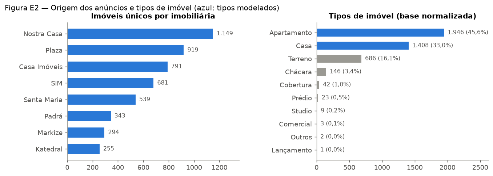
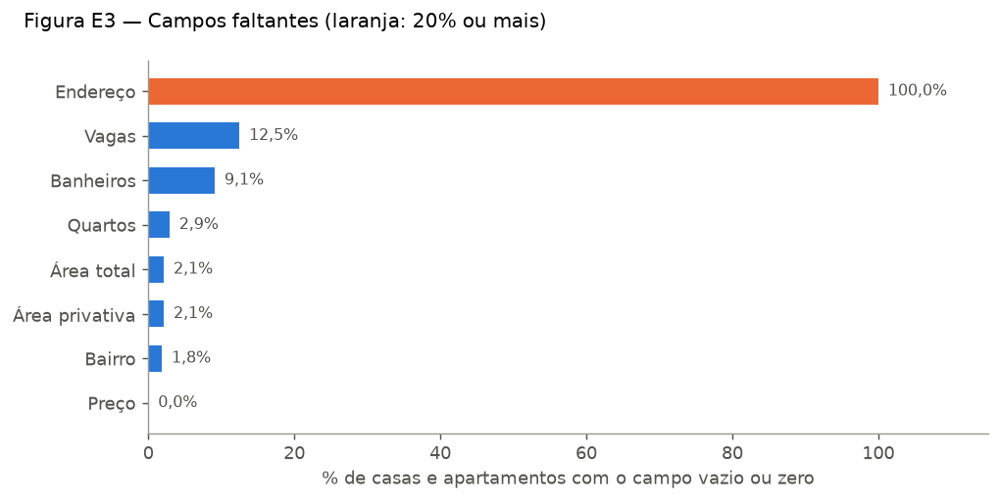
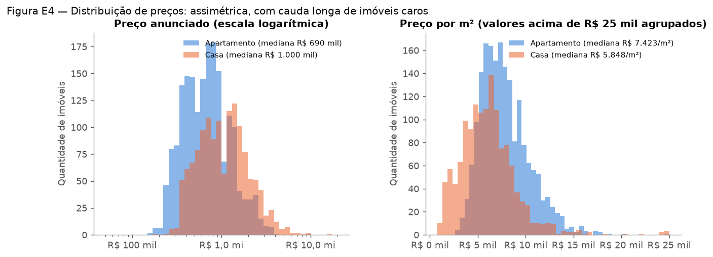
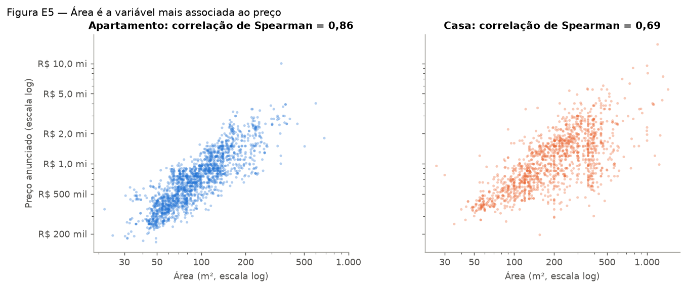
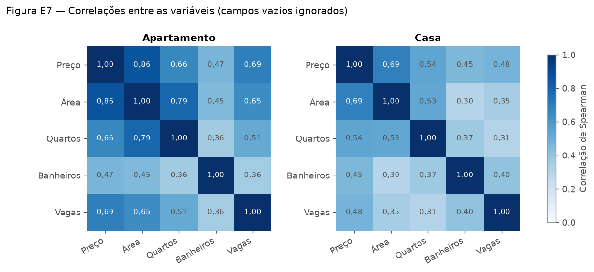
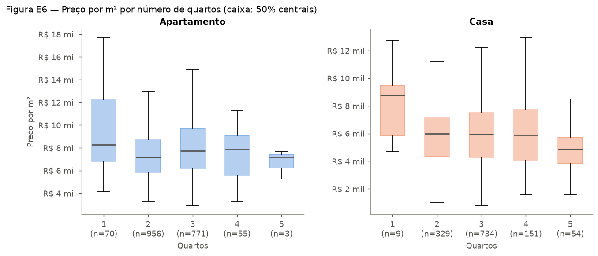
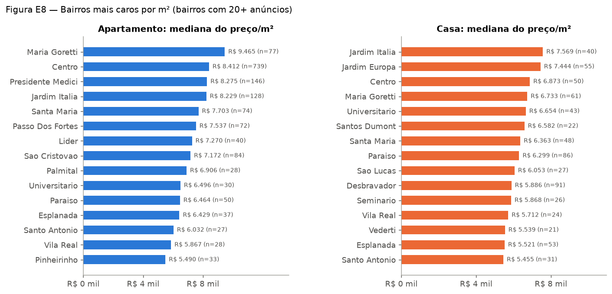
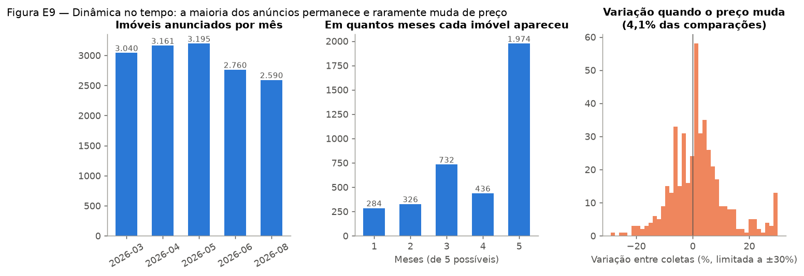

# 2. Análise Exploratória de Dados (EDA)

Objetivo: conhecer a base antes de modelar — tamanho, origem, qualidade, distribuição
dos preços, relação entre as variáveis e comportamento dos preços ao longo do tempo.
As figuras são geradas por `python scripts_predict/eda.py`.

Salvo indicação contrária, as estatísticas usam **casas e apartamentos com preço entre
R$ 50 mil e R$ 20 milhões e área entre 20 m² e 2.000 m²** (3.242 imóveis), para que
erros de cadastro não distorçam os gráficos. Os erros de cadastro são analisados à parte
na seção 2.3.

## 2.1 Tamanho e origem da base

- 4.266 imóveis após a deduplicação, vindos de 8 imobiliárias. A maior fonte (Nostra
  Casa, 1.149 imóveis) tem cerca de 4,5 vezes o tamanho da menor (Katedral, 255).
- **Apartamentos (45,6%) e casas (33,0%) somam 78,6% da base** e são os dois tipos
  modelados. Terrenos (16,1%) e chácaras (3,4%) têm lógica de preço diferente (preço da
  terra, não da construção) e os demais tipos têm poucos exemplos.
- 247 grafias distintas de bairro; o Centro concentra a maior parte dos apartamentos
  (739 dos 1.880).

## 2.2 Campos faltantes

| Campo | Casas e apartamentos sem o dado |
|---|---:|
| Endereço | 100,0% |
| Vagas | 12,5% |
| Banheiros | 9,1% |
| Quartos | 2,9% |
| Área total / privativa | 2,1% |
| Bairro | 1,8% |
| Preço | 0,0% (anúncios sem preço já foram descartados) |

- **Nenhuma imobiliária expõe o endereço** de forma utilizável; a localização do
  imóvel fica restrita ao bairro. Isso limita o modelo: dentro do mesmo bairro há ruas
  com valores muito diferentes.
- Vagas e banheiros vazios são tratados como `0`; os modelos de árvore (CatBoost,
  XGBoost, Random Forest) lidam bem com isso, mas é uma fonte de ruído.
- Considerando todos os tipos de imóvel, os faltantes são maiores (quartos 21%,
  banheiros 26%, vagas 29%), porque terrenos e chácaras não têm esses campos.

## 2.3 Erros de cadastro encontrados

Entre as 3.354 casas e apartamentos:

| Problema | Casos | Exemplo | Provável causa |
|---|---:|---|---|
| Preço abaixo de R$ 50 mil | 19 | Casa de 420 m² por "R$ 1,35" | Valor digitado em milhões (R$ 1,35 mi) |
| Preço acima de R$ 20 milhões | 2 | Casa por R$ 904 milhões | Dígitos a mais / centavos colados |
| Área abaixo de 20 m² | 89 | — | Campo preenchido em outra unidade ou vazio |
| Área acima de 2.000 m² | 3 | Apartamento de 140.964 m² | Erro de digitação |
| Vagas absurdas | — | Apartamento com 409 vagas | Erro de digitação |
| Cidade sem acento (toda a base) | 1.235 | "chapeco" x "chapecó" | Grafia diferente entre fontes |
| Cidade fora de Chapecó ou inválida (toda a base) | 15 | Guatambu, Itapema, nome de rua no campo cidade | Imóveis da região ou campo trocado |

Consequências para a modelagem:

- O **MAPE** (erro percentual médio) fica inutilizável: um único imóvel de "R$ 1,35"
  gera um erro de milhões de por cento. Por isso os resultados usam MAE, RMSE, R² e o
  **erro percentual mediano**, que não é afetado por esses casos.
- Os modelos usam limites aprendidos no treino (clipagem por quantis e remoção de
  outliers por IQR) e os resultados são reportados em duas versões: teste "típico" e
  teste "completo" (capítulo 4).

## 2.4 Distribuição dos preços

| | Apartamento | Casa |
|---|---:|---:|
| Imóveis | 1.880 | 1.362 |
| Preço — 10% mais baratos até | R$ 320 mil | R$ 450 mil |
| Preço — mediana | **R$ 690 mil** | **R$ 1,00 milhão** |
| Preço — 10% mais caros a partir de | R$ 1,50 milhão | R$ 2,49 milhões |
| Área — mediana | 87 m² | 200 m² |
| Preço/m² — mediana | **R$ 7.423** | **R$ 5.848** |
| Preço/m² — faixa central (25% a 75%) | R$ 5.957 a R$ 9.338 | R$ 4.119 a R$ 7.470 |

- A distribuição do preço é **muito assimétrica** (assimetria 3,5 em apartamentos e 3,9
  em casas): poucos imóveis muito caros puxam a média para cima. Em escala logarítmica a
  assimetria cai para 0,3 — por isso os modelos testam o alvo em `log(preço)`.
- Casas custam mais no total, mas **apartamentos custam mais por m²** (R$ 7,4 mil contra
  R$ 5,8 mil): casas têm muito mais área, e parte dela é terreno.
- A dispersão do preço/m² das casas é maior, o que antecipa que casas serão mais
  difíceis de prever.

## 2.5 Relação entre as variáveis e o preço

Correlação de Spearman com o preço (mede relação crescente, mesmo não linear):

| Variável | Apartamento | Casa |
|---|---:|---:|
| Área | **0,86** | **0,69** |
| Vagas | 0,69 | 0,48 |
| Quartos | 0,66 | 0,54 |
| Banheiros | 0,47 | 0,45 |

- **A área é, de longe, a variável mais importante.** Em apartamentos, ela sozinha
  ordena bem os preços (0,86); em casas a relação é mais fraca (0,69) — o mesmo tamanho
  pode ser uma casa simples em terreno grande ou uma casa de alto padrão.
- Quartos e área são fortemente ligados entre si (0,79 em apartamentos): mais quartos
  quase sempre significa mais área. Parte da informação é redundante.
- Nenhuma variável captura **padrão de acabamento, idade ou estado de conservação** —
  informações que as imobiliárias não publicam de forma estruturada e que explicam boa
  parte do erro que sobra nos modelos.

- O preço/m² **não sobe** com o número de quartos: imóveis maiores têm preço total
  maior, mas o m² fica estável ou até cai (efeito de escala).
- Apartamentos de 1 quarto (studios e compactos) têm o maior preço/m² e a maior
  dispersão.

## 2.6 Localização (bairro)

- Os bairros mais caros por m² para apartamentos são **Maria Goretti (R$ 9.465)**,
  Centro (R$ 8.412), Presidente Medici e Jardim Itália (cerca de R$ 8.250).
- Para casas: **Jardim Itália (R$ 7.569)**, Jardim Europa, Centro, Maria Goretti e
  Universitário.
- A diferença entre o bairro mais caro e o mais barato da lista chega a **70%** no preço
  por m² de apartamentos — o bairro é a segunda informação mais importante depois da
  área.
- Muitos bairros têm poucos anúncios; nos modelos, bairros com menos de 10 imóveis são
  agrupados em "outros" para evitar estimativas instáveis.

## 2.7 Dinâmica no tempo

- Entre 2.590 e 3.195 imóveis anunciados por mês; o número caiu em junho e agosto
  (imóveis vendidos ou retirados e menos anúncios novos).
- **1.974 imóveis (53%) aparecem nos 5 meses** coletados — o estoque é estável, e a
  maior parte fica meses anunciada.
- Comparando o preço do mesmo imóvel entre coletas consecutivas (10.984 comparações):
  - **95,9% não mudaram de preço**;
  - 2,5% subiram (mediana da alta: +4,7%);
  - 1,5% caíram (mediana da queda: −6,0%).
- Quando o preço muda, a mudança é grande e discreta (degraus de 5% a 10%), e não um
  ajuste gradual. Essa "rigidez" do preço anunciado é o principal desafio para prever
  valorização (capítulo 5).

## 2.8 Conclusões da EDA que orientaram a modelagem

1. **Modelar casas e apartamentos separadamente**: distribuições, preço/m² e relação
   com a área são diferentes.
2. **Testar o alvo em escala logarítmica**, pela assimetria dos preços.
3. **Tratar erros de cadastro com regras aprendidas só no treino** (clipagem e IQR) e
   reportar o teste com e sem outliers.
4. **Não usar o MAPE** como métrica principal; usar MAE, RMSE, R² e erro percentual
   mediano.
5. **Agrupar bairros raros**, já que o bairro é a principal informação de localização.
6. **Esperar pouco sinal na valorização mensal**: 96% dos preços não mudam de uma
   coleta para a outra.
7. Limitação estrutural: sem endereço, padrão construtivo ou idade do imóvel, parte do
   preço não é explicável com as variáveis disponíveis.
