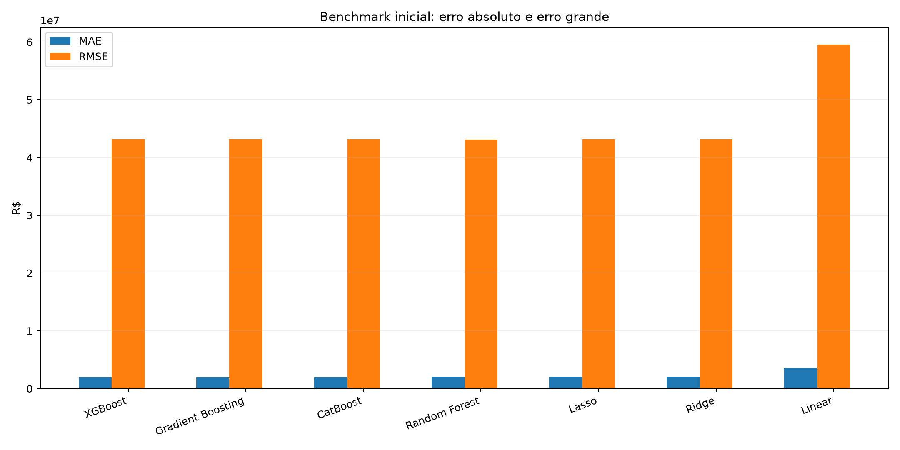
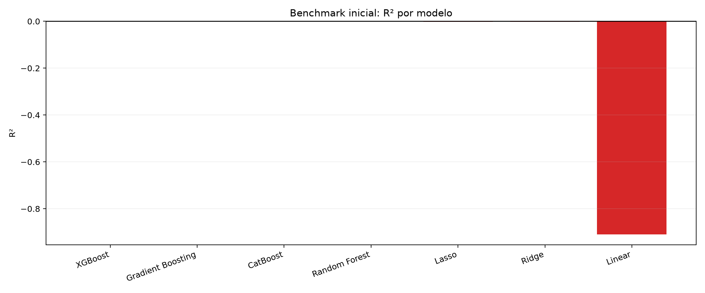
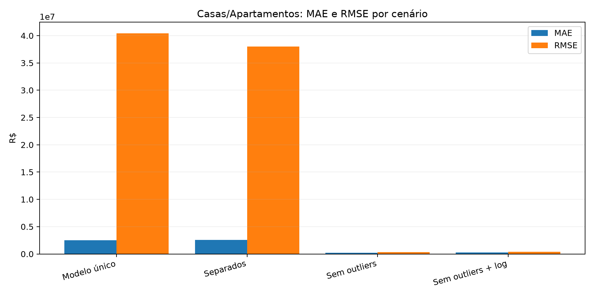
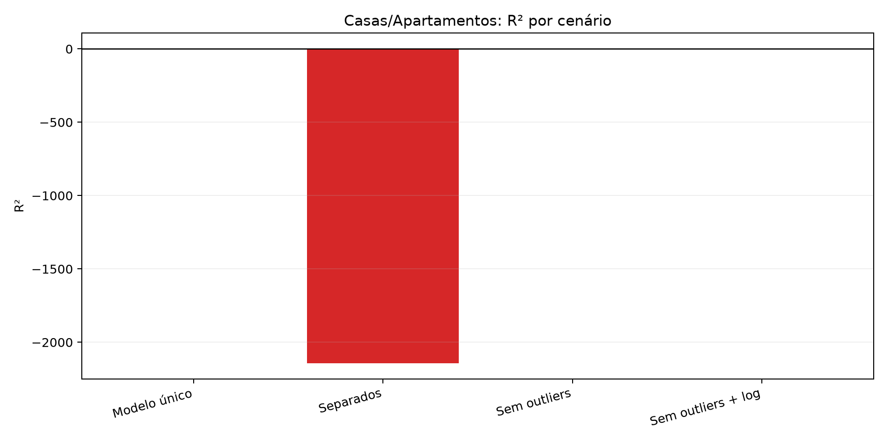
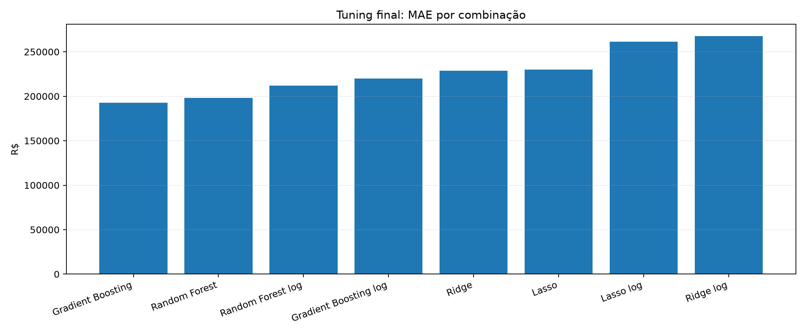
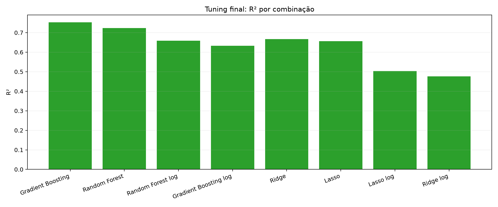

# 3. Evolução dos modelos de preço

Este capítulo registra o caminho percorrido até o modelo final (capítulo 4): o que foi
testado, o que funcionou e o que foi corrigido. **Atenção:** os números das etapas 3.1 a
3.6 foram medidos com o protocolo de avaliação da época, que tinha vazamento de dados
(ver 3.7). Eles servem para mostrar a evolução, mas não devem ser comparados diretamente
com os resultados finais.

## 3.1 Primeiro benchmark: todos os tipos juntos

Modelos: Regressão Linear, Ridge, Lasso, Random Forest, Gradient Boosting, XGBoost e
CatBoost, com todos os tipos de imóvel (inclusive terrenos e chácaras) em um só modelo.

- R² próximo de zero ou negativo na primeira rodada; na melhor rodada posterior, 0,35
  (Random Forest, MAE de R$ 424 mil).
- Os modelos lineares explodiram (erros na casa dos trilhões) por causa de imóveis com
  áreas e preços absurdos (seção 2.3).
- **Lição:** com a base bruta, trocar de algoritmo não resolve; o problema está nos dados.

## 3.2 Foco em casas e apartamentos e remoção de outliers

| Cenário | R² |
|---|---:|
| Casas e apartamentos, modelo único | ≈ 0,00 |
| Casas e apartamentos, modelos separados | negativo |
| **Sem outliers (IQR)** | **0,66** |
| Sem outliers + alvo em log(preço) | 0,46 |

- **Lição:** o maior ganho veio da limpeza de outliers, não da escolha do modelo.

## 3.3 Ajuste de hiperparâmetros

- Melhor combinação: Gradient Boosting com alvo em `preco` (R² 0,75, MAE R$ 193 mil).
- Os outliers eram removidos da base inteira **antes** de separar treino e teste, então
  o teste ficava "limpo" artificialmente.

## 3.4 Baseline com ensemble mediano

- Separação por tipo (Casa / Apartamento), bairros raros agrupados em "outros" e
  clipagem de valores extremos por quantis.
- Previsão pela **mediana** de vários modelos (Gradient Boosting, Random Forest, Ridge,
  XGBoost, CatBoost), para reduzir a instabilidade de um modelo isolado.

## 3.5 Pipeline alternativo

- Regressão Linear Múltipla, Random Forest, Gradient Boosting, Rede Neural (MLP) e SVM,
  sem as regras de limpeza do baseline.
- Melhor resultado: SVM, com R² de −0,08.
- **Lição:** sem o tratamento dos dados, mesmo modelos mais sofisticados não aprendem.

## 3.6 Modelo híbrido (primeira versão)

Combinou tudo o que funcionou: segmentação por tipo, bairros raros, clipagem, remoção de
outliers, alvo em `preco` e `log(preco)`, e um ensemble dos 3 melhores modelos de cada
segmento, ponderado pelo inverso do erro. O resultado reportado na época foi
**R² = 0,85 e MAE = R$ 146 mil**.

## 3.7 Correção da avaliação: vazamento de dados

Na revisão do código, foram encontrados três problemas na forma de medir o desempenho
da primeira versão do híbrido:

1. **O ensemble avaliado era treinado com a base inteira, inclusive o conjunto de
   teste.** O modelo "já tinha visto" os imóveis em que era testado.
2. **Os modelos do ensemble eram escolhidos pelo desempenho no próprio teste.**
3. **Limpeza antes da separação:** bairros raros, limites de clipagem e de outliers eram
   calculados com a base inteira, e o teste ficava sem outliers artificialmente.

Esses três pontos tornam o resultado otimista: o R² de 0,85 não representa o desempenho
em imóveis novos. A avaliação foi refeita com um protocolo correto:

- o teste (20%) é separado **antes** de qualquer pré-processamento;
- todas as regras de limpeza são aprendidas **só no treino** e aplicadas ao teste;
- os modelos e os pesos do ensemble são escolhidos por **validação cruzada (5 partes)
  dentro do treino**; o teste é usado uma única vez, no final;
- o teste é reportado em duas versões: **típico** (sem outliers, pelos limites do
  treino) e **completo** (com todos os anúncios, inclusive os com erro de cadastro).

| Versão do híbrido | R² | MAE |
|---|---:|---:|
| Primeira versão (avaliação com vazamento) | 0,85 | R$ 146 mil |
| **Avaliação corrigida — teste típico** | **0,68** | **R$ 192 mil** |
| Avaliação corrigida — teste completo | 0,51 | R$ 273 mil |

A queda não significa que o modelo piorou: o modelo é o mesmo, e **agora o número
reflete o erro esperado em um imóvel que o modelo nunca viu**. Esse é o valor correto a
apresentar.

## 3.8 Inclusão do TabPFN v2

O TabPFN v2 (Hollmann et al., *Nature*, 2025) é um "modelo de fundação" para dados
tabulares: um transformer pré-treinado em milhões de conjuntos sintéticos, que faz a
previsão por aprendizado em contexto, sem treino por gradiente nos nossos dados. Ele foi
incluído como candidato em todos os benchmarks (capítulos 4 e 5).

## 3.9 Resumo da evolução

| Etapa | Principal mudança | Lição |
|---|---|---|
| 3.1 | Vários algoritmos, todos os tipos | A base bruta não permite aprender |
| 3.2 | Casas/apartamentos + remoção de outliers | Qualidade dos dados > algoritmo |
| 3.3 | Ajuste de hiperparâmetros | Ganho pequeno em relação à limpeza |
| 3.4 | Ensemble mediano segmentado | Estabilidade das previsões |
| 3.5 | Modelos alternativos sem limpeza | Confirma a importância do tratamento |
| 3.6 | Híbrido: segmentação + limpeza + ensemble | Melhor arquitetura |
| 3.7 | **Avaliação sem vazamento** | Números honestos (R² 0,68) |
| 3.8 | TabPFN v2 | Melhor candidato individual na validação cruzada |

Relatórios brutos da época: `docs/reports/modelo_comparativo.md`,
`experimentos_casas_apartamentos.md`, `tuning_casas_apartamentos.md` e
`modelo_alternativo.md`.
