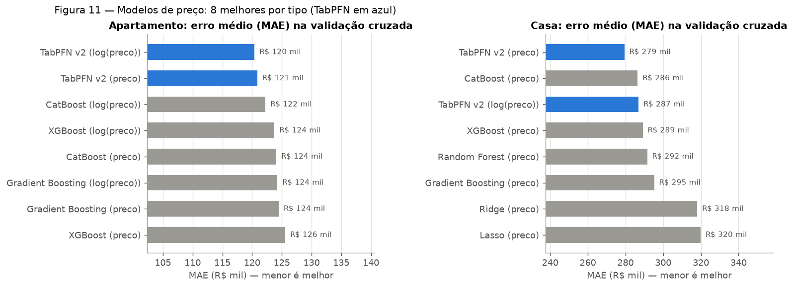
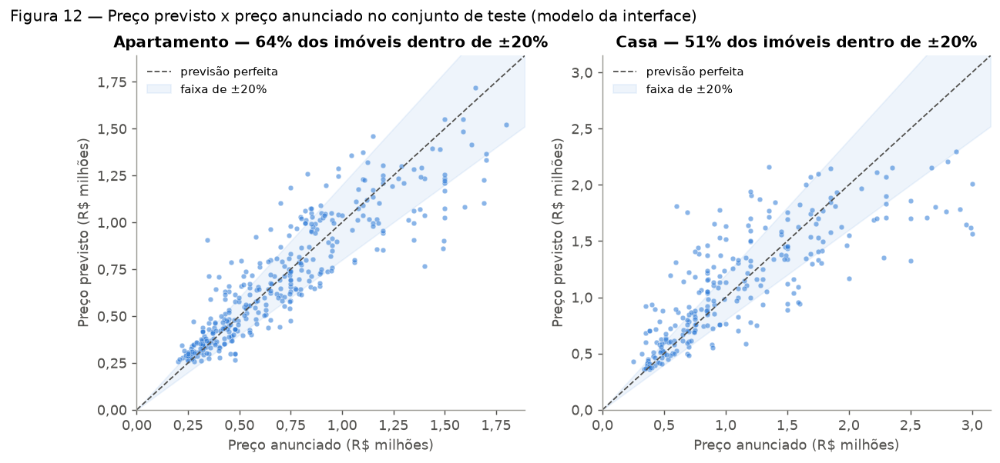

# 4. Modelo de preço atual (híbrido)

Estima **quanto um imóvel vale hoje** a partir das suas características. É o primeiro
passo da projeção de valor ao longo dos anos (capítulo 5) e da interface (capítulo 6).

Código: `scripts_predict/imoveis_ml_hibrido.py`. Relatório completo:
`docs/reports/modelo_hibrido.md`.

## 4.1 Variáveis

| Tipo | Variáveis |
|---|---|
| Numéricas | área total, área privativa, quartos, banheiros, vagas |
| Categóricas | bairro, tipo de imóvel |
| Alvo | preço anunciado (testado em `preco` e em `log(preco)`) |

## 4.2 Arquitetura

Para cada segmento (**Casa** e **Apartamento**), separadamente:

1. **Separação treino/teste (80/20)** antes de qualquer tratamento.
2. **Tratamento aprendido só no treino:** bairros com menos de 10 imóveis viram
   "outros"; variáveis numéricas são limitadas aos quantis de 2% e 98%; outliers de
   preço e de preço/m² são removidos por IQR (1,5×).
3. **Candidatos** (cada um com alvo em `preco` e em `log(preco)` — 20 combinações):
   Regressão Linear Múltipla, Ridge, Lasso, Random Forest, Gradient Boosting, Rede
   Neural (MLP), SVM, XGBoost, CatBoost e TabPFN v2.
4. **Ranking por validação cruzada (5 partes) dentro do treino**, pelo MAE.
5. **Ensemble**: média ponderada dos 3 melhores, com peso proporcional a 1/MAE.
6. **Avaliação** no teste, que não participou de nenhuma escolha.
7. **Modelo final**: retreinado com todos os dados do segmento para uso em produção.

O pré-processamento fica dentro de um `Pipeline` do scikit-learn (vazios viram 0,
números padronizados com `StandardScaler`, bairro e tipo em colunas binárias com
`OneHotEncoder`), para que a previsão receba exatamente o mesmo tratamento do treino. O
alvo em log usa `TransformedTargetRegressor` (treina em log(1 + preço) e devolve reais).

### Como funciona cada candidato

| Modelo | Família | Ideia | Parâmetros | Pontos positivos | Pontos negativos |
|---|---|---|---|---|---|
| Regressão Linear Múltipla | linear | preço = soma de pesos das variáveis | — | simples de explicar | só relações em linha reta; sensível a outliers |
| Ridge | linear (penalização L2) | igual à linear, mas limita o tamanho dos pesos | alpha 5,0 | estável com variáveis correlacionadas (área e quartos) | continua linear |
| Lasso | linear (penalização L1) | pode zerar pesos de variáveis inúteis | alpha 0,0005 | ajuda a interpretar | continua linear |
| Random Forest | árvores em paralelo (bagging) | média de 400 árvores, cada uma com um sorteio dos dados | 400 árvores, mín. 2 por folha | robusto a outliers e a parâmetros | não extrapola; arquivo grande |
| Gradient Boosting | árvores em sequência (boosting) | cada árvore corrige o erro das anteriores | 500 árvores, taxa 0,05, profundidade 3 | costuma ser o melhor em tabelas | treino mais lento |
| XGBoost | boosting otimizado | boosting com amostragem e regularização | 400 árvores, taxa 0,05, profundidade 6, amostragem 90% | rápido e robusto | muitos parâmetros |
| CatBoost | boosting com árvores simétricas | boosting que trata bem variáveis categóricas | 500 iterações, taxa 0,05, profundidade 6 | melhor com o bairro; bom sem ajuste | precisou de adaptador para o scikit-learn 1.6+ (`sklearn_compat.py`) |
| Rede Neural (MLP) | rede neural | camadas de neurônios que combinam as variáveis | camadas 128 e 64, ReLU, parada antecipada | capta padrões complexos com muitos dados | instável com 1 a 2 mil exemplos |
| SVM (SVR) | vetores de suporte | curva que passa perto da maioria dos pontos (kernel RBF) | C 20, epsilon 0,1 | bom em bases médias | muito sensível à escala do alvo |
| TabPFN v2 | modelo de fundação (transformer) | pré-treinado em tabelas sintéticas; prevê pelo contexto, sem treino nos nossos dados | nenhum ajuste | venceu a validação cruzada sem configuração | lento em CPU, 179 MB, até 10 mil linhas |

Os modelos de árvore venceram porque o preço não é uma soma linear das características
(o preço/m² não sobe com o número de quartos, seção 2.5) e porque são pouco afetados por
valores estranhos. MLP e SVM ficaram por último: com 1.000 a 1.400 imóveis por tipo, não
há dados suficientes para eles.

## 4.3 Ranking dos candidatos



- **O TabPFN v2 ficou em 1º lugar nos dois segmentos** na validação cruzada
  (apartamento: MAE R$ 120 mil; casa: R$ 279 mil).
- Logo atrás vêm os modelos de *gradient boosting* (CatBoost, XGBoost, Gradient
  Boosting) e o Random Forest, com diferenças de 1% a 5%.
- Os modelos lineares (Ridge, Lasso, Regressão Linear) ficaram cerca de 14% piores em
  casas: a relação entre as variáveis e o preço não é linear.
- MLP e SVM ficaram fora dos 10 primeiros nos dois segmentos.

## 4.4 Resultados no teste

Foram treinadas duas versões do ensemble: **com TabPFN** (o candidato vence e entra no
ensemble) e **sem TabPFN** (usada na interface; ver 4.6).

| Segmento | Versão | Modelos no ensemble | MAE | R² (típico) | R² (completo) |
|---|---|---|---:|---:|---:|
| Apartamento | com TabPFN | TabPFN (log) + TabPFN + CatBoost (log) | R$ 121.836 | 0,785 | 0,620 |
| Apartamento | **sem TabPFN** | CatBoost (log) + XGBoost (log) + CatBoost | **R$ 119.640** | **0,795** | 0,630 |
| Casa | com TabPFN | TabPFN + CatBoost + TabPFN (log) | R$ 293.975 | 0,564 | 0,396 |
| Casa | **sem TabPFN** | CatBoost + XGBoost + Random Forest | **R$ 291.216** | **0,559** | 0,397 |
| **Geral** | com TabPFN | — | R$ 194.536 | 0,679 | 0,503 |
| **Geral** | **sem TabPFN** | — | **R$ 192.102** | **0,678** | 0,506 |

- **Com e sem TabPFN, os resultados no teste são praticamente iguais** (diferença de
  cerca de 1% no MAE). O TabPFN vence na validação cruzada, mas essa vantagem não se
  confirma no teste: a diferença entre os melhores candidatos é menor que a variação
  natural entre amostras.
- **Apartamentos são bem mais previsíveis que casas** (R² 0,80 contra 0,56), como a EDA
  antecipava: a área explica muito mais o preço de um apartamento.
- O teste "completo" (com anúncios de preço absurdo, como "R$ 1,35") derruba o R², o que
  mostra o peso dos erros de cadastro.

## 4.5 Qualidade das previsões na prática



Erro percentual de cada previsão no teste típico (modelo sem TabPFN):

| Segmento | Erro percentual mediano | Previsões com erro de até ±10% | Previsões com erro de até ±20% |
|---|---:|---:|---:|
| Apartamento | **14,8%** | 35% | **64%** |
| Casa | **19,6%** | 30% | **51%** |

Erro por faixa de preço (MAE; faixas = quartis do teste):

| Apartamento | MAE | Erro % mediano | | Casa | MAE | Erro % mediano |
|---|---:|---:|---|---|---:|---:|
| até R$ 410 mil | R$ 65 mil | 15,1% | | até R$ 597 mil | R$ 212 mil | 15,5% |
| R$ 410–650 mil | R$ 93 mil | 15,0% | | R$ 597–904 mil | R$ 231 mil | 20,2% |
| R$ 650–900 mil | R$ 131 mil | 16,3% | | R$ 904 mil–1,5 mi | R$ 269 mil | 19,6% |
| acima de R$ 900 mil | R$ 192 mil | 13,1% | | acima de R$ 1,5 mi | R$ 472 mil | 20,6% |

- Em reais, o erro cresce com o preço; **em percentual ele é estável** (13% a 16% em
  apartamentos, 15% a 21% em casas). Uma forma honesta de comunicar: "o valor estimado
  costuma ficar a cerca de 15% (apartamentos) ou 20% (casas) do preço anunciado".
- Nos imóveis mais caros o modelo tende a **subestimar** (pontos abaixo da diagonal na
  figura): há poucos exemplos de alto padrão e nenhuma variável de acabamento.

## 4.6 Escolha do modelo usado na interface

A interface usa o ensemble **sem TabPFN** (`modelos/preco_imovel_modelo_hibrido_rapido.pkl`):

- no teste, a precisão é equivalente (MAE R$ 192 mil contra R$ 195 mil);
- rodando em CPU, **cada previsão com TabPFN leva cerca de 2 minutos**, porque o modelo
  reprocessa todo o conjunto de treino a cada consulta; sem ele, a resposta é imediata;
- o arquivo do modelo cai de 179 MB para 24 MB, o que facilita a publicação do site.

## 4.7 Limitações

- Preço anunciado não é preço de venda (a negociação costuma reduzir o valor final).
- Sem endereço, padrão construtivo, idade ou estado de conservação.
- Poucos exemplos de alto padrão e de bairros pequenos.
- A base mistura casas de padrões muito diferentes (sobrado, geminada, casa em terreno
  grande), o que limita o R² das casas.

## 4.8 Como reproduzir

```bash
# benchmark completo (com TabPFN, ~25 min em CPU) -> docs/reports/modelo_hibrido.md
python scripts_predict/imoveis_ml_hibrido.py benchmark-hibrido --normalized-db imoveis_normalizados.db --report-path docs/reports/modelo_hibrido.md
# modelo usado na interface (sem TabPFN, ~2 min)
DISABLE_TABPFN=1 python scripts_predict/imoveis_ml_hibrido.py train-hibrido --normalized-db imoveis_normalizados.db --model-path modelos/preco_imovel_modelo_hibrido_rapido.pkl
```
