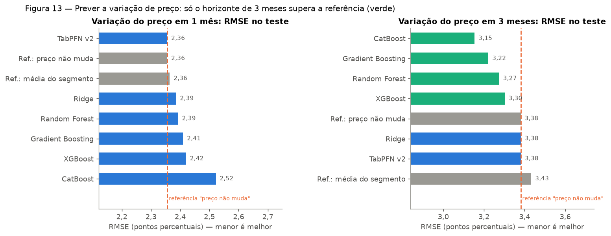
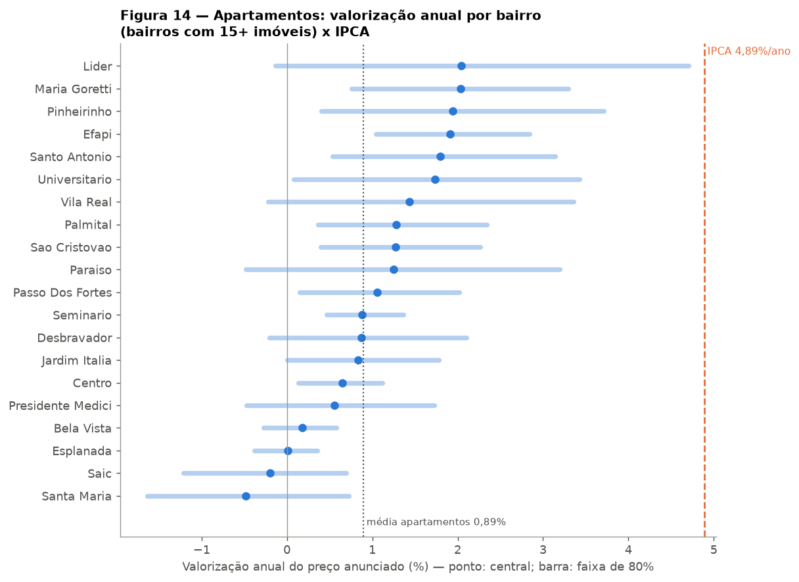

# 5. Valorização e projeção do valor ao longo dos anos

O objetivo final do trabalho é estimar **quanto um imóvel pode valer ao longo dos
anos**. Isso foi abordado em duas partes:

1. **Valorização de curto prazo (1 e 3 meses)**: é possível prever, com aprendizado de
   máquina, quanto o preço anunciado de um imóvel vai variar? (`imoveis_valorizacao.py`)
2. **Projeção de longo prazo (anos)**: valor de hoje (capítulo 4) × taxa de
   valorização medida por bairro, com cenários e comparação com a inflação.
   (`imoveis_projecao.py`)

## 5.1 Dados usados

A tabela `historico_precos` guarda o preço de cada imóvel em cada coleta. Para cada mês
fica um preço por imóvel (mediana das coletas do mês), formando um **painel** de 3.752
imóveis em 5 meses (março, abril, maio, junho e agosto de 2026). A técnica usada é a de
*repeat listings*: comparar o preço do **mesmo** imóvel em momentos diferentes, o que
elimina as diferenças de tamanho, bairro e padrão entre imóveis.

## 5.2 Valorização de curto prazo: é previsível?

### Formulação

- **Alvo**: variação do preço do mesmo imóvel entre o mês *t* e *t + h*, em log.
- **Variáveis** (só informação disponível no mês *t*, sem olhar o futuro): área,
  quartos, banheiros, vagas, bairro, tipo, preço/m², preço relativo à mediana do
  segmento, há quantos meses está anunciado, variação anterior do próprio anúncio e
  tendência recente do bairro e do tipo.
- **Validação temporal**: o teste é sempre o último mês disponível, nunca visto no
  treino; o ranking dos modelos usa validação cruzada agrupada por imóvel (o mesmo
  imóvel nunca está no treino e na validação ao mesmo tempo).
- **Referências obrigatórias**: "o preço não muda" e "variação média do segmento". Um
  modelo só é útil se for melhor que elas.
- **Métrica principal**: RMSE em pontos percentuais (p.p.).

### Resultados



| Modelo | RMSE 1 mês (p.p.) | RMSE 3 meses (p.p.) |
|---|---:|---:|
| Referência: preço não muda | **2,356** | 3,381 |
| Referência: média do segmento | 2,364 | 3,433 |
| TabPFN v2 | **2,356** | 3,382 |
| Ridge | 2,386 | 3,382 |
| Random Forest | 2,393 | 3,275 |
| Gradient Boosting | 2,410 | 3,222 |
| XGBoost | 2,420 | 3,302 |
| CatBoost | 2,522 | **3,154** |

Horizonte de 1 mês: 5.977 pares de treino e 2.589 de teste (junho/2026). Horizonte de 3
meses: 2.266 de treino e 2.259 de teste (agosto/2026).

- **1 mês: nenhum modelo supera "o preço não muda".** O TabPFN empata com ela. Como 96%
  dos anúncios não mudam de preço em um mês, a melhor previsão é "não vai mudar".
- **3 meses: CatBoost, Gradient Boosting, Random Forest e XGBoost superam a
  referência.** O CatBoost reduz o erro em 6,7% (3,15 contra 3,38 p.p.) e explica 20% da
  variação (R² 0,20). Com mais tempo, mais anúncios mudam de preço (9% em 3 meses) e há
  padrão para aprender.
- O TabPFN, melhor modelo para o preço de hoje, **não** aprende a variação: ele empata
  com "não muda" nos dois horizontes.

### Chance de redução de preço

Classificador que estima a probabilidade de o preço cair mais de 0,5% (AUC 0,5 = sorteio;
1,0 = perfeito):

| Classificador | AUC 1 mês | AUC 3 meses |
|---|---:|---:|
| Taxa histórica (referência) | 0,500 | 0,500 |
| Regressão Logística | 0,651 | 0,603 |
| **Gradient Boosting** | **0,691** | **0,733** |

Há sinal para identificar **quais imóveis têm mais chance de baixar o preço** (AUC 0,73
em 3 meses). Como as reduções são raras (1% a 4% dos casos), isso ainda não se traduz em previsões
precisas do tamanho da variação.

## 5.3 Projeção de longo prazo

Com apenas 5 meses de dados, não é possível treinar um modelo que preveja diretamente 5
ou 10 anos à frente. A projeção combina, então, o modelo de preço com uma taxa de
valorização estimada nos dados, e apresenta **cenários**, não uma previsão exata.

### Método

1. **Valor hoje**: modelo de preço do capítulo 4.
2. **Taxa de valorização por bairro e tipo**: soma das variações log dos mesmos imóveis
   dividida pela soma dos meses decorridos, anualizada.
3. **Bairros com poucos dados** são puxados para a taxa geral do tipo, por
   credibilidade: peso do bairro = n / (n + 30), em que *n* é o número de imóveis
   acompanhados. Um bairro com 30 imóveis pesa 50%; com 90, 75%.
4. **Incerteza**: *bootstrap* por imóvel (1.000 reamostragens) → intervalo de 80%
   (cenários pessimista e otimista).
5. **Projeção**: valor(ano) = valor hoje × exp(12 × taxa mensal × ano).
6. **Referência: IPCA**. Não existe índice de preços de imóveis (FipeZap) para Chapecó;
   o IPCA oficial (IBGE, série 433 do Banco Central) mostra quanto o imóvel valeria se
   apenas acompanhasse a inflação. Padrão: **média anual dos últimos 10 anos (+4,89%)**;
   alternativa: acumulado de 12 meses (+4,22%, até agosto/2026).

### Taxas encontradas

| Tipo | Imóveis | Pessimista | **Central** | Otimista | IPCA (média 10 anos) |
|---|---:|---:|---:|---:|---:|
| Apartamento | 2.010 | +0,57%/ano | **+0,89%/ano** | +1,24%/ano | +4,89%/ano |
| Casa | 1.458 | +0,01%/ano | **+0,38%/ano** | +0,75%/ano | +4,89%/ano |



- **A valorização do preço anunciado ficou muito abaixo da inflação** em todos os bairros:
  mesmo no cenário otimista, nenhum bairro com 15 ou mais imóveis chega a 4,89% ao ano.
- Os bairros com maior valorização de apartamentos foram Líder, Maria Goretti,
  Pinheirinho e Efapi (cerca de +2% ao ano); Santa Maria, Saic e Esplanada ficaram
  próximos de zero ou negativos.
- A taxa está disponível para 71 combinações de bairro e tipo; os demais bairros usam a
  taxa do tipo. Tabela completa: `docs/reports/taxas_valorizacao_anual.md`.

### Exemplo

Apartamento no Centro, 80 m² privativos, 2 quartos, 2 banheiros, 1 vaga:

| | Hoje | Em 10 anos |
|---|---:|---:|
| Cenário central (+0,65%/ano) | R$ 630.776 | R$ 672.838 |
| Acompanhando o IPCA (+4,89%/ano) | R$ 630.776 | R$ 1.016.485 |

### Por que a valorização medida é tão baixa

Não significa que os imóveis de Chapecó perdem valor em termos reais. Os motivos
prováveis são:

1. **Preço anunciado é rígido**: 96% dos anúncios não mudam de preço de um mês para o
   outro. O vendedor define o preço na entrada e raramente o reajusta.
2. **Viés de sobrevivência**: imóveis bem precificados são vendidos e saem do painel; os
   que ficam são justamente os que não estão sendo reajustados.
3. **Janela curta**: 5 meses é pouco para medir uma tendência anual, e o período pode
   não representar um ano inteiro.
4. **Imóveis novos entram com preço atualizado**, mas não entram na medida, que só
   compara o mesmo imóvel ao longo do tempo.

Por isso a interface mostra **os dois cenários lado a lado**: a tendência observada nos
anúncios e a referência da inflação. Com mais meses de coleta, a taxa medida tende a
ficar mais confiável.

## 5.4 Como reproduzir

```bash
python scripts_predict/imoveis_valorizacao.py benchmark-valorizacao --horizonte 1 --report-path docs/reports/modelo_valorizacao_h1.md
python scripts_predict/imoveis_valorizacao.py benchmark-valorizacao --horizonte 3 --report-path docs/reports/modelo_valorizacao_h3.md
python scripts_predict/imoveis_projecao.py train-projecao
python scripts_predict/imoveis_projecao.py projetar --bairro Centro --tipo-imovel Apartamento --area-privada 80 --area-total 100 --quartos 2 --banheiros 2 --vagas 1 --anos 10
```
