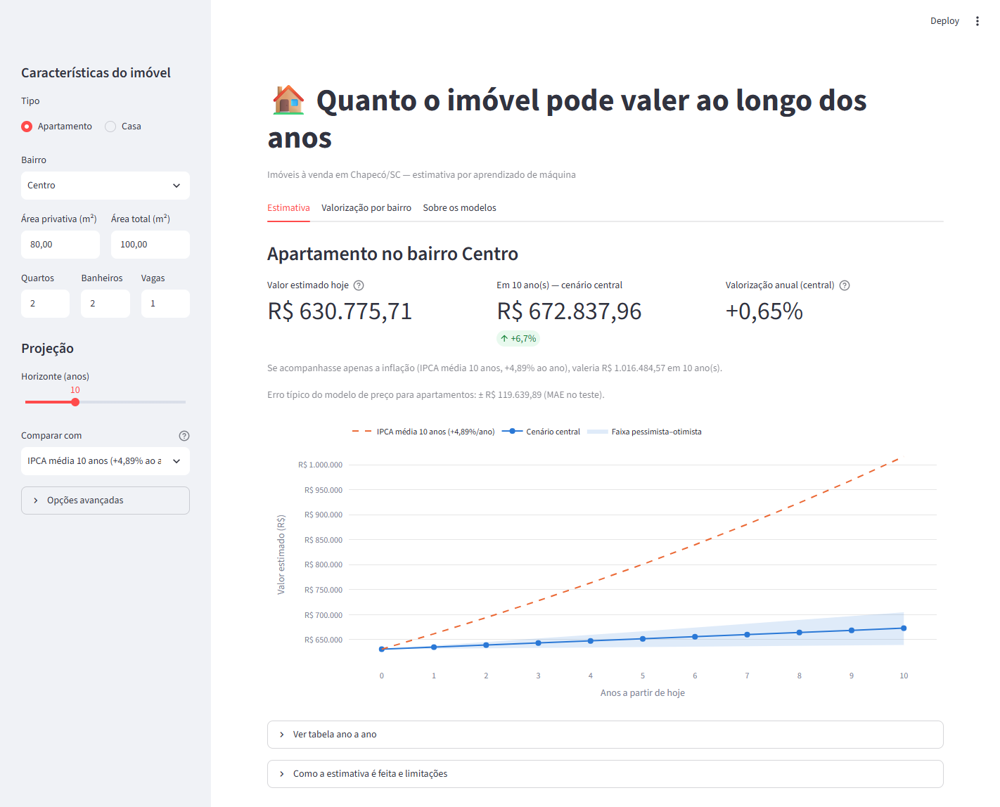
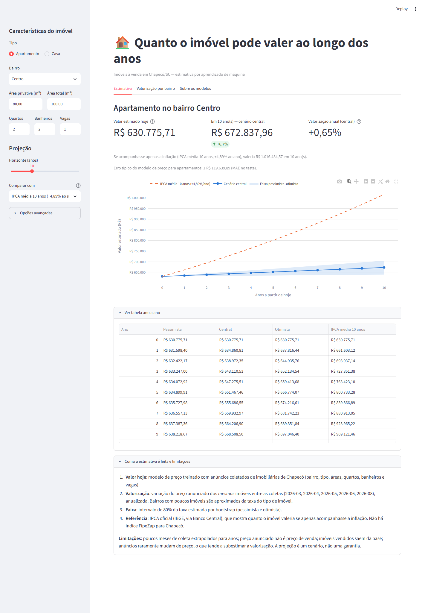
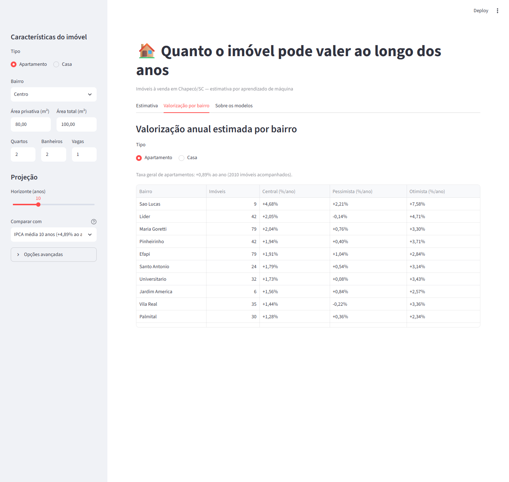
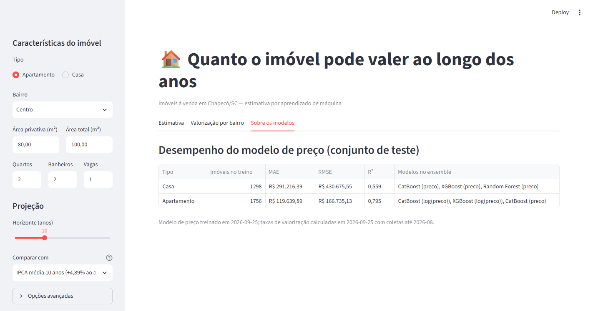

# 6. Interface

Aplicação web em **Streamlit** (`interface/app.py`) onde qualquer pessoa informa as
características de um imóvel e recebe o valor estimado hoje e a projeção ano a ano.

```bash
python -m streamlit run interface/app.py     # abre em http://localhost:8501
```

## 6.1 Tela de estimativa



**Entrada (barra lateral):**

- tipo (Apartamento ou Casa) e bairro (lista dos bairros com anúncios na base);
- área privativa, área total, quartos, banheiros e vagas;
- horizonte da projeção (1 a 30 anos);
- cenário de comparação: IPCA média de 10 anos (padrão), IPCA de 12 meses, outra taxa
  ou nenhum;
- opções avançadas: informar o preço atual em vez de usar o valor estimado.

**Saída:**

- valor estimado hoje, com o erro típico do modelo para o tipo de imóvel;
- valor no fim do horizonte (cenário central) e a variação acumulada;
- taxa de valorização anual do bairro, com a faixa pessimista–otimista;
- quanto o imóvel valeria se apenas acompanhasse a inflação;
- gráfico interativo com o cenário central, a faixa de incerteza e a linha do IPCA;
- aviso quando o bairro tem poucos dados e foi usada a taxa geral do tipo.

## 6.2 Tabela ano a ano e explicação do método



A tabela mostra os quatro cenários para cada ano. A seção "Como a estimativa é feita e
limitações" explica, em linguagem simples, de onde vem cada número e os cuidados na
interpretação.

## 6.3 Valorização por bairro



Ranking dos bairros pela valorização anual estimada, com o número de imóveis
acompanhados e a faixa de incerteza, para apartamentos e para casas.

## 6.4 Sobre os modelos



Desempenho do modelo de preço no conjunto de teste (MAE, RMSE e R² por tipo) e os
modelos que compõem o ensemble.

## 6.5 Decisões de projeto

- **Modelo sem TabPFN na interface**: resposta imediata, com precisão equivalente
  (seção 4.6).
- **Modelos carregados uma única vez** e mantidos em memória (`st.cache_resource`).
- **Segurança**: os modelos são arquivos `.pkl` (que executam código ao serem abertos);
  cada um tem uma assinatura HMAC-SHA256 (`.sig`) e só é carregado se a assinatura
  conferir (`scripts_predict/model_io.py`).
- **Formato brasileiro**: valores em R$ e porcentagens com vírgula decimal.
- **Transparência**: a interface sempre mostra a incerteza (faixa e erro típico) e as
  limitações, em vez de um número único.
