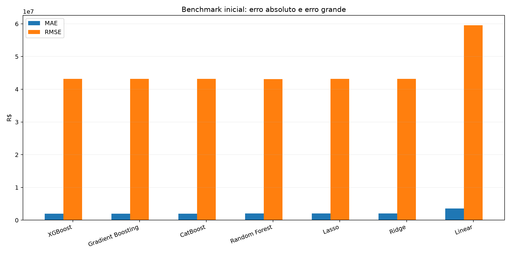
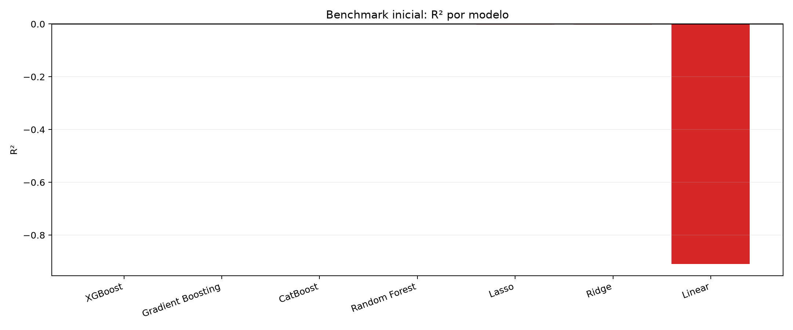
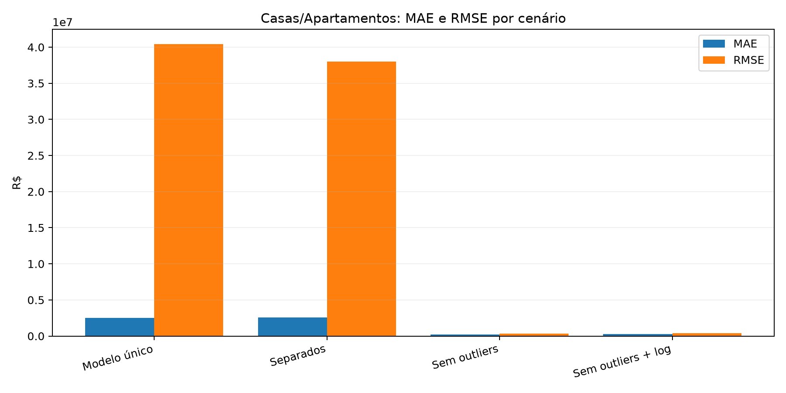
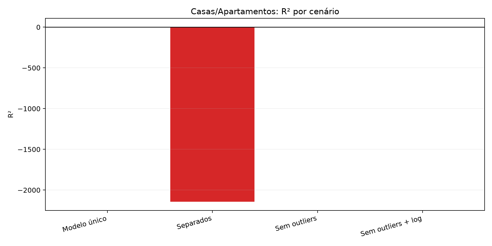
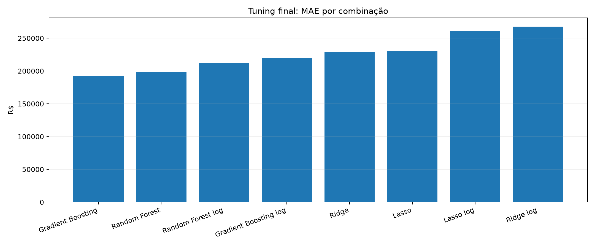
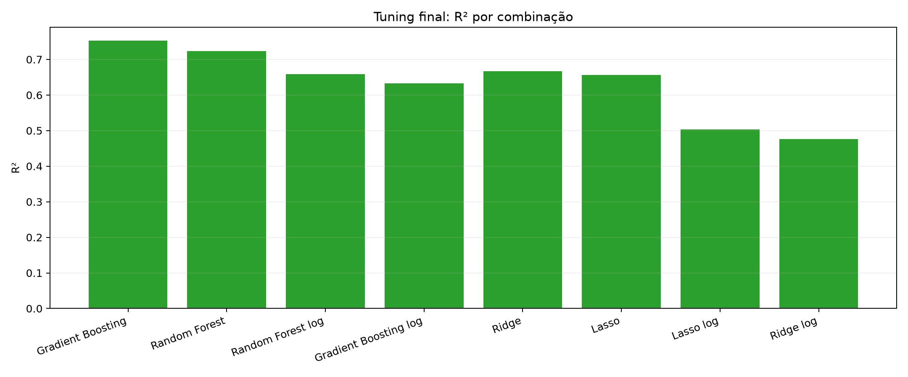
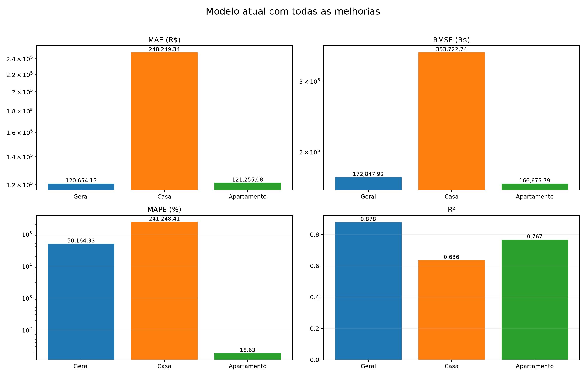

# Gráfico comparativo de resultados

## 1. Benchmark inicial

**Leitura:**
- O primeiro gráfico mostra **MAE** e **RMSE**.
- O segundo mostra **R²**.
- No benchmark geral, os erros ficaram muito altos e o `R²` ficou perto de zero ou negativo.
- Isso indica muito ruído no conjunto completo e pouca explicação do preço com as features atuais.

## 2. Casas/Apartamentos por cenário

**Leitura:**
- O cenário com **sem outliers** foi o que mais reduziu erro.
- Separar apenas por tipo, sem limpar outliers, não ajudou muito.
- O `R²` melhora de forma clara quando o conjunto fica mais limpo.
- Isso mostra que a qualidade do dado pesa mais do que só trocar o algoritmo.

## 3. Tuning final

**Leitura:**
- O melhor resultado por `MAE` ficou com **Gradient Boosting** no alvo bruto (`preco`).
- O `R²` também ficou melhor nessa configuração.
- As versões com `log(preco)` não venceram aqui.
- Isso reforça que o melhor ganho veio de **limpeza + segmentação + tuning simples**.

## 4. Modelo atual com todas as melhorias

**Leitura:**
- O gráfico compara o resultado **geral** com os segmentos **Casa** e **Apartamento**.
- O painel de **MAE** mostra o erro médio em reais.
- O painel de **RMSE** mostra o peso dos erros grandes.
- O painel de **MAPE** é útil como referência, mas pode ficar inflado em alguns conjuntos.
- O painel de **R²** mostra a capacidade explicativa do modelo.
- Aqui dá para ver que o baseline atual ficou bem melhor após:
  - segmentação por tipo
  - bairros raros agrupados
  - clipagem de extremos
  - ensemble mediano

## 5. Como interpretar cada métrica

- **MAE**: erro médio em reais. Quanto menor, melhor.
- **RMSE**: erro médio com mais peso para erros grandes. Quanto menor, melhor.
- **MAPE**: erro percentual médio. Quanto menor, melhor.
- **R²**: quanto do preço o modelo consegue explicar. Quanto mais perto de 1, melhor.

## 6. Resumo visual

- **MAE baixo**: modelo erra menos no dia a dia.
- **RMSE alto**: existem alguns erros muito grandes.
- **R² baixo**: o modelo ainda entende pouco a variação dos preços.
- **R² alto + MAE baixo**: melhor combinação para uso prático.

## 7. Por que apartamento ficou melhor que casa

- O segmento de **Apartamento** ficou mais homogêneo e previsível.
- Apartamentos costumam ter faixa de área mais concentrada, menos variação estrutural e padrões de preço mais consistentes.
- **Casa** mistura mais casos diferentes: sobrado, geminada, condomínio, área rural, terrenos grandes e bairros com pouca amostra.
- Isso aumenta o ruído e deixa o ajuste mais difícil.
- Em resumo, apartamento é um problema mais regular para o modelo aprender; casas ainda pedem mais segmentação por bairro ou faixa de área.
