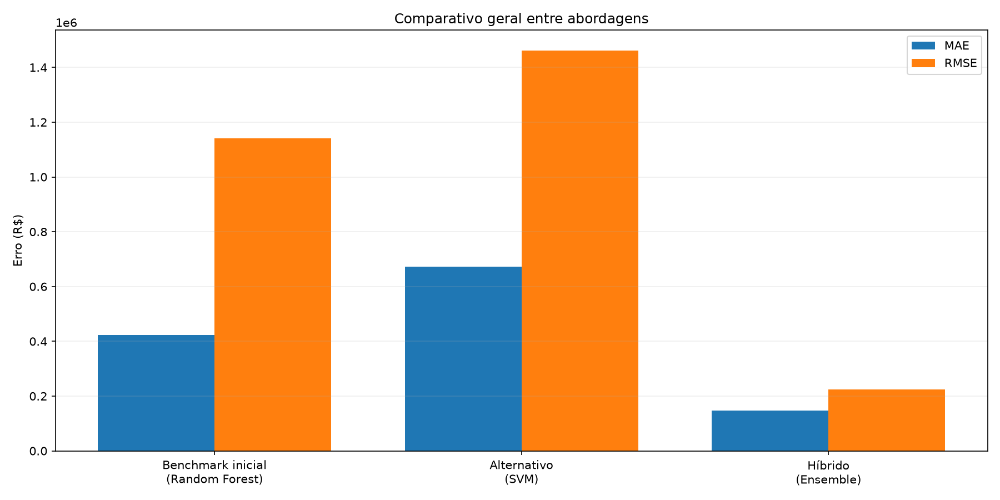
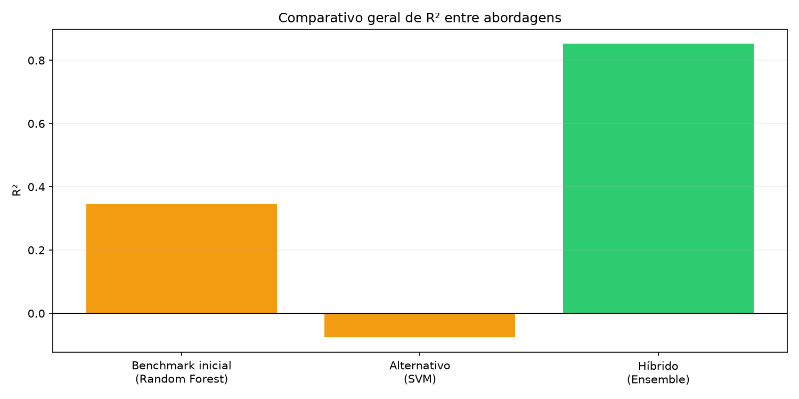
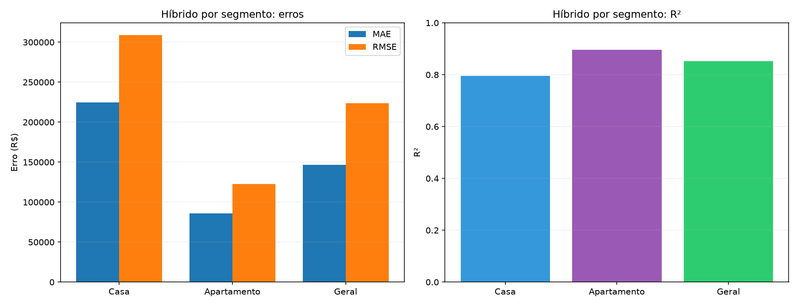

# 9. Modelo Hibrido - Detalhado

## Visao geral

O modelo hibrido (`scripts_predict/imoveis_ml_hibrido.py`) foi criado para maximizar qualidade de previsao em um cenario com alta variacao entre fontes, tipos de imovel e bairros.  
A estrategia final combina **regras de saneamento aprendidas no baseline** com **ensemble de multiplos algoritmos** por segmento.

Resultado consolidado da abordagem:

- **MAE:** R$ 146.412,39
- **RMSE:** R$ 223.825,41
- **R²:** 0,8526

## Problema que o hibrido resolve

Nos experimentos iniciais, um unico modelo para toda a base sofria com:

- heterogeneidade alta (casa e apartamento com dinamicas bem diferentes);
- bairros com pouca amostra gerando ruido;
- outliers de preco e metragem distorcendo ajuste;
- algoritmos com comportamentos distintos por segmento.

O hibrido resolve isso com uma pipeline em etapas:

1. separa por tipo (Casa e Apartamento);
2. normaliza distribuicao de bairros raros;
3. reduz impacto de extremos numericos;
4. remove outliers por IQR em cada segmento;
5. testa varios modelos e dois alvos (`preco` e `log(preco)`);
6. seleciona os melhores e combina em ensemble ponderado.

## Base e features

Base de treino:

- `imoveis_normalizados.db`
- tabela `imoveis_normalizados`
- registros com `preco > 0`
- nulos numericos tratados como `0`

Features usadas:

- `area_total`
- `area_privada`
- `quartos`
- `banheiros`
- `vagas`
- `bairro`
- `tipo_imovel`

Pre-processamento:

- imputacao de faltantes (`SimpleImputer`);
- padronizacao numerica (`StandardScaler`);
- codificacao categorica (`OneHotEncoder`).

## Arquitetura do modelo

### 1) Segmentacao por tipo

O treino ocorre separadamente para:

- **Casa**
- **Apartamento**

Isso reduz mistura de padroes de preco e melhora a coerencia estatistica em cada subconjunto.

### 2) Regras de robustez de dados

Para cada segmento:

- bairros com baixa frequencia sao agrupados em `outros`;
- features numericas passam por clipping por quantis (2% e 98%);
- outliers sao removidos via IQR.

Essas regras diminuem variancia e evitam que poucos casos extremos dominem o treino.

### 3) Candidatos avaliados

Modelos testados por segmento:

- Regressao Linear Multipla
- Ridge
- Lasso
- Random Forest
- Gradient Boosting
- MLP
- SVM
- XGBoost (se instalado)
- CatBoost (se instalado)

Cada modelo e testado em dois modos de alvo:

- `preco`
- `log(preco)` (com `TransformedTargetRegressor`)

### 4) Selecao e ensemble

Para cada segmento:

1. ranking por **MAE** na validacao hold-out;
2. selecao dos top `N=3` candidatos;
3. treino final desses candidatos no segmento;
4. previsao final por **media ponderada**.

Peso de cada modelo no ensemble:

`peso_i = (1 / MAE_i) / soma(1 / MAE_j)`

Ou seja, quanto menor o MAE individual, maior o peso no ensemble final.

## Resultados detalhados

Fonte: `docs/reports/modelo_hibrido.md`.

### Resultado geral

| Metrica | Valor |
|---|---:|
| MAE | R$ 146.412,39 |
| RMSE | R$ 223.825,41 |
| R² | 0,8526 |

### Segmento Casa

| Metrica | Valor |
|---|---:|
| Registros | 1.254 |
| MAE (ensemble) | R$ 224.729,22 |
| RMSE (ensemble) | R$ 308.751,39 |
| R² (ensemble) | 0,7950 |

Modelos escolhidos:

- Gradient Boosting (`preco`) - peso 0,341
- Random Forest (`preco`) - peso 0,340
- Regressao Linear Multipla (`preco`) - peso 0,319

### Segmento Apartamento

| Metrica | Valor |
|---|---:|
| Registros | 1.620 |
| MAE (ensemble) | R$ 85.741,01 |
| RMSE (ensemble) | R$ 122.714,43 |
| R² (ensemble) | 0,8959 |

Modelos escolhidos:

- Random Forest (`log(preco)`) - peso 0,334
- Random Forest (`preco`) - peso 0,334
- Gradient Boosting (`log(preco)`) - peso 0,332

## Por que o resultado final foi melhor

O ganho principal nao veio de um unico algoritmo, e sim da combinacao de 4 fatores:

1. **Reducao de heterogeneidade**  
   Separar Casa e Apartamento elimina parte importante do ruido estrutural.

2. **Saneamento estatistico antes do treino**  
   Agrupamento de bairros raros + clipping + remocao de outliers melhora estabilidade.

3. **Escolha orientada por metrica em cada segmento**  
   O melhor algoritmo muda conforme o tipo de imovel; o hibrido respeita isso.

4. **Ensemble ponderado**  
   A media ponderada reduz erro idiossincratico de modelos individuais.

Na pratica, isso explica o salto de qualidade observado no comparativo geral:

- benchmark inicial: MAE R$ 423.618,02 / R² 0,3459
- alternativo: MAE R$ 672.439,71 / R² -0,0757
- **hibrido**: MAE R$ 146.412,39 / R² 0,8526

## Leitura dos graficos

Comparativo de abordagens:





Hibrido por segmento:



Interpretacao direta:

- o hibrido reduz erro absoluto e erro quadratico de forma relevante;
- o R² final alto confirma melhor capacidade explicativa;
- apartamento segue mais previsivel que casa por maior homogeneidade de padrao.

## Limitacoes atuais

- MAPE pode inflar em registros com preco muito baixo e nao deve guiar decisao sozinho;
- o modelo esta focado em Casa/Apartamento; outros tipos ficam fora do fluxo hibrido;
- ganhos adicionais dependem de mais sinais de qualidade (ex.: estado de conservacao, padrao construtivo, localizacao mais granular).

## Operacao

Comandos do modelo hibrido:

```bash
make benchmark-models-hibrido
make train-price-model-hibrido
make predict-price-hibrido ARGS="--area-total 80.2 --area-privada 80.2 --bairro 'Vila Real' --tipo-imovel Apartamento --quartos 3 --banheiros 1 --vagas 2"
```

Comandos diretos:

```bash
python3 scripts_predict/imoveis_ml_hibrido.py benchmark-hibrido --normalized-db imoveis_normalizados.db --report-path docs/modelo_hibrido.md
python3 scripts_predict/imoveis_ml_hibrido.py train-hibrido --normalized-db imoveis_normalizados.db --model-path modelos/preco_imovel_modelo_hibrido.pkl
python3 scripts_predict/imoveis_ml_hibrido.py predict-hibrido --model-path modelos/preco_imovel_modelo_hibrido.pkl --area-total 80.2 --area-privada 80.2 --bairro "Vila Real" --tipo-imovel Apartamento --quartos 3 --banheiros 1 --vagas 2
```
